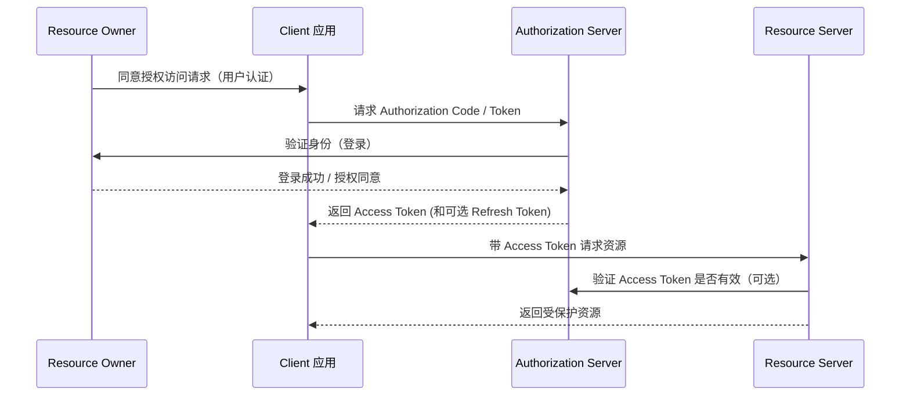

---

# OAuth2 协议概述

## 1️⃣ 定义

**OAuth2**（Open Authorization 2.0）是一种开放标准协议，目的是**让用户在不暴露密码的情况下，授权第三方应用访问自己的受保护资源
**。

---

## 2️⃣ 核心思想

1. **分离认证和授权**

    * 认证：确认用户是谁
    * 授权：用户允许客户端能做什么
2. **使用令牌（Access Token）代替密码**

    * 客户端用 token 请求资源，不需要用户密码
3. **最小权限原则**

    * 客户端只能访问用户授权的资源范围（scope）

---

## 3️⃣ 核心角色

| 角色                          | 功能                            |
|-----------------------------|-------------------------------|
| Resource Owner（资源所有者）       | 用户本人，拥有受保护资源                  |
| Client（客户端）                 | 需要访问资源的应用                     |
| Resource Server（资源服务器）      | 提供受保护资源的服务器                   |
| Authorization Server（授权服务器） | 负责验证用户身份，发放访问令牌（Access Token） |

---

## 4️⃣ 核心概念

1. **Access Token**

    * 用于访问资源的凭证
    * 有效期有限，可撤销
2. **Refresh Token**

    * 用于获取新的 Access Token，延长会话
3. **Scope**

    * 表示访问权限的范围（如“读邮件”“编辑文档”）
4. **Grant Type（授权类型）**

    * OAuth2 定义了几种获取 token 的方式：

        * Authorization Code（标准 Web 授权码）
        * Implicit（简化前端授权）
        * Resource Owner Password Credentials（用户名密码模式）
        * Client Credentials（客户端自身访问资源）

---

## 5️⃣ 协议作用

1. **安全授权**

    * 用户不需要把密码交给第三方应用
2. **集中管理访问权限**

    * Authorization Server 可以统一控制谁能访问哪些资源
3. **支持最小权限和即时撤销**

    * 通过 scope 和 token 有效期控制
4. **支持跨平台和第三方应用**

    * API、移动端、Web 都可使用同一套机制

---

## 6️⃣ 面试简洁表述（20 秒版本）

> OAuth2 是一个开放标准协议，主要解决用户授权问题：允许客户端应用在不暴露用户密码的前提下访问受保护资源。它把认证和授权分离，通过
> Access Token 代表用户权限，并可限制访问范围（scope）和有效期，支持安全、可控的资源访问。

---

**OAuth2 协议角色和流程图**，一张图就能讲清整个协议流。

Resource Owner（用户）

    拥有受保护资源，决定是否授权给客户端。

Client（应用）

    想访问资源的应用，需要用户授权。

Authorization Server（授权服务器）

负责：

    用户身份认证
    
    颁发 Access Token
    
    可选颁发 Refresh Token

Resource Server（资源服务器）

    提供实际资源
    
    校验客户端提交的 Access Token 是否有效
    
    决定是否放行请求

Access Token / Scope

    Token 代表用户授权
    
    Scope 定义访问范围（最小权限）