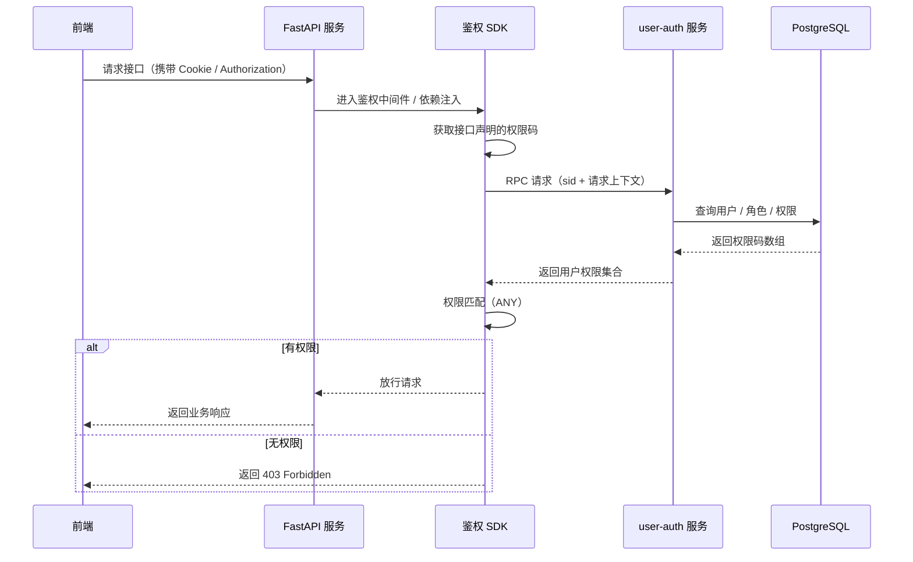
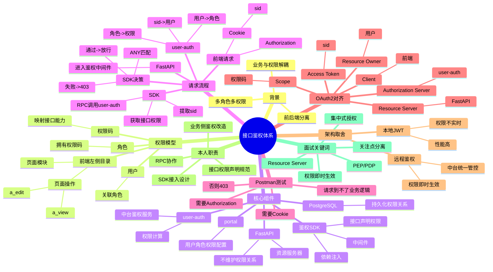

---

# 接口鉴权体系整体流程 & OAuth2 对照说明

## 1. 文档目的

本文档用于梳理本人在公司参与的接口鉴权改造项目，  
从**业务流程、技术架构、权限模型**三个层面说明整体鉴权机制，  
并将该体系与 **OAuth2 标准模型**进行概念对齐，  
以便后续复盘、面试表达与知识沉淀。

---

## 2. 系统整体架构概览

系统运行在 Kubernetes 集群中，由业务部门与中台部门协作完成。

### 2.1 核心组件

- **前端系统**
    - 提供左侧目录树（菜单）
    - 控制页面与操作入口
- **业务服务（FastAPI）**
    - 提供具体业务 API
    - 不直接维护用户 / 角色 / 权限
- **鉴权 SDK（Python pip 包）**
    - 由业务部门维护
    - 以中间件 + 依赖注入方式接入 FastAPI
- **user-auth 服务（中台）**
    - 统一鉴权服务
    - 负责用户权限计算与返回
- **portal 服务（中台）**
    - 用户 / 角色 / 权限配置系统
- **数据库**
    - PostgreSQL
    - 持久化用户、角色、权限关系

---

## 3. 权限模型设计（业务视角）

### 3.1 权限来源：前端左侧目录树

前端左侧目录树定义了系统中的功能模块与页面操作。

示例：

- 页面模块：`a`
- 页面操作权限：
    - `a_view`：查看页面
    - `a_edit`：编辑页面

**每一个页面操作对应一个权限码（permission code）**。

---

### 3.2 核心实体关系

```text
用户 (User)
  ↓ 关联
角色 (Role)
  ↓ 拥有
权限码 (Permission Code)
  ↓ 映射
接口操作 (API)
````

---

### 3.3 权限配置（portal 系统）

在中台 portal 系统中完成：

1. 创建角色
2. 给角色分配：

    * 可访问的左侧目录
    * 对应页面操作权限（如 a_view / a_edit）
3. 用户创建时关联角色
4. 数据最终存储至 PostgreSQL

> 表结构细节由中台维护，业务侧只依赖权限结果。

---

## 4. 接口鉴权运行时流程（核心）

### 4.1 请求整体流程图



---

### 4.2 FastAPI 侧（业务服务）

* 接口在定义时，通过依赖注入声明所需权限码
* 权限声明靠近接口定义
* 业务代码不感知用户、角色细节

示例（概念）：

```python
@router.post(
    "/a/edit",
    dependencies=[Depends(require_permissions(["a_edit"]))]
)
def edit_a():
    ...
```

---

### 4.3 鉴权 SDK（业务侧实现）

SDK 的职责：

1. 从请求中提取：

    * Cookie 中的 sid
    * Authorization 头
2. 收集接口声明的权限码
3. 调用 user-auth RPC 接口
4. 接收用户权限码数组
5. 执行权限匹配逻辑：

```text
接口所需权限 ∩ 用户权限 ≠ ∅ → 放行
否则 → 返回 403
```

---

### 4.4 user-auth 服务（中台）

user-auth 负责 **授权决策数据的计算**：

1. sid → 用户身份
2. 用户 → 角色
3. 角色 → 权限码集合
4. 返回权限码数组给业务侧 SDK

---

## 5. Postman 日常测试开发场景

### 5.1 为什么 Postman 需要携带 Cookie 和 Authorization？

* 浏览器登录后：

    * 自动保存 Cookie（sid）
    * 前端自动携带 Authorization
* Postman 是独立客户端：

    * 需要手动模拟已登录态

如果不携带相关头部信息：

* 请求会在鉴权层被直接拦截
* 返回 403
* 请求不会进入 FastAPI 业务逻辑

---

### 5.2 说明的问题

* 鉴权发生在业务逻辑之前
* 属于统一鉴权 / 中间件 / 网关层能力
* 避免未授权请求进入业务系统

---

## 6. 与 OAuth2 的关系说明（概念对齐）

### 6.1 角色对齐

| OAuth2 标准角色          | 当前系统                 |
|----------------------|----------------------|
| Resource Owner       | 用户                   |
| Client               | 前端                   |
| Resource Server      | FastAPI 业务服务         |
| Authorization Server | user-auth（授权维度）      |
| Access Token         | sid                  |
| Scope                | 权限码（a_view / a_edit） |

---

### 6.2 核心对齐结论

* sid 在语义上等价于 OAuth2 的 access_token
* 接口权限码等价于 OAuth2 中的 scope
* FastAPI 服务扮演 Resource Server
* 鉴权 SDK 是 Policy Enforcement Point（PEP）
* user-auth 是授权决策服务（PDP）

---

### 6.3 与“标准 OAuth2 JWT 模型”的差异

| 项目   | JWT 本地校验 | 当前方案   |
|------|----------|--------|
| 权限存储 | Token 内  | 中台实时计算 |
| 校验方式 | 本地       | RPC    |
| 权限变更 | 不实时      | 即时生效   |
| 性能   | 高        | 略低     |
| 管控能力 | 一般       | 强      |

当前方案属于：

> **OAuth2 Resource Server 模型的工程化变体**
> 以权限集中管理与即时生效为核心目标。

---

## 7. 个人职责边界总结

* 负责业务侧 FastAPI 接口鉴权改造
* 设计并接入 Python 鉴权 SDK
* 参与接口权限声明规范制定
* 与中台协作定义 RPC 协议

不涉及：

* 中台权限策略设计
* 数据库表结构维护
* Token 签发流程

---

## 8. 总结

该项目让我系统理解了企业级系统中：

* 认证与授权的解耦
* 集中式授权架构的设计取舍
* OAuth2 Resource Server 模型在实际工程中的落地形态

为后续系统设计与面试表达提供了重要实践基础。

```
```

# 接口鉴权体系 · 面试速记脑图

